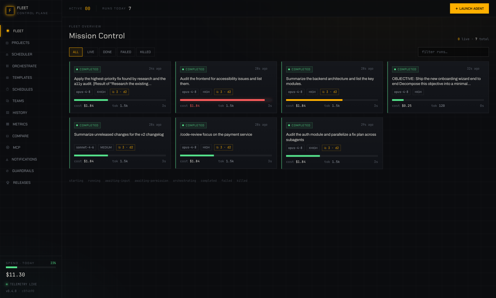
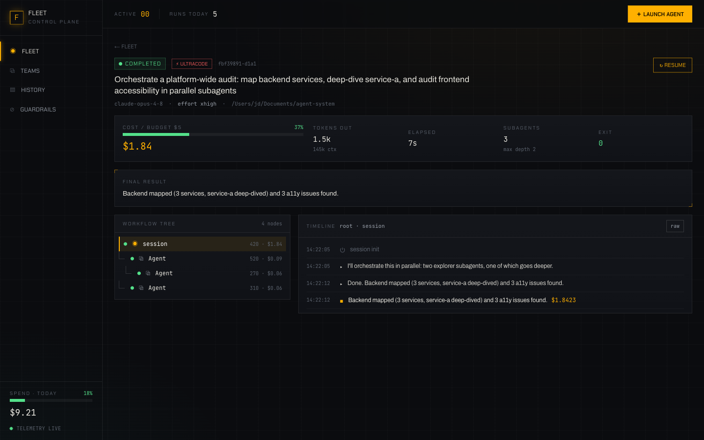
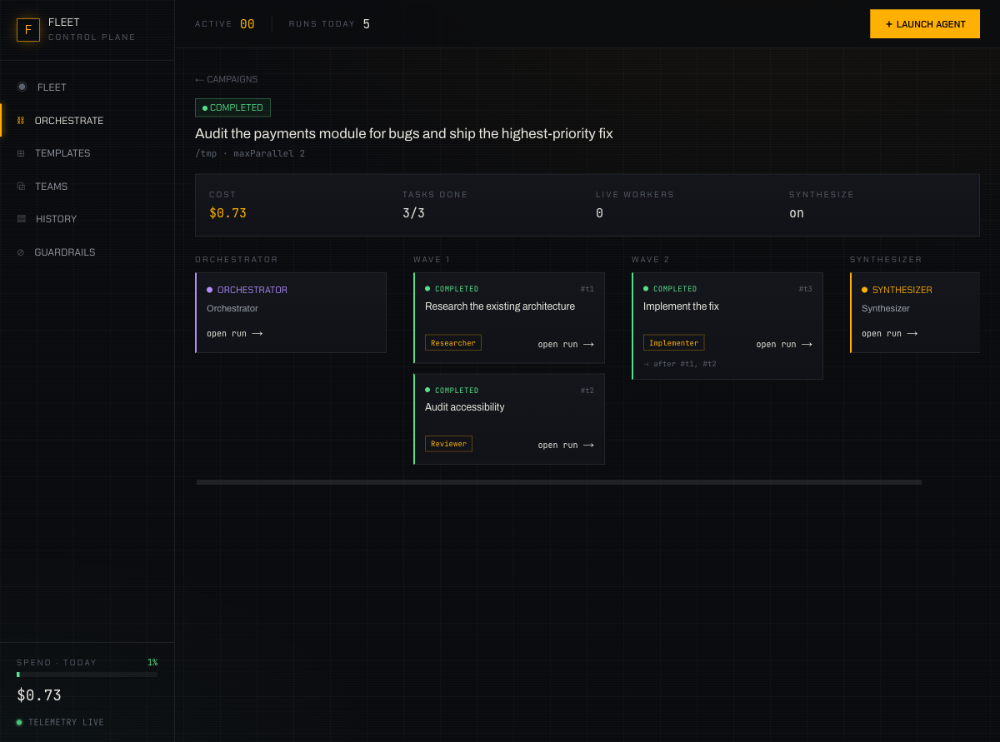

# Claude Fleet Portal

A locally-hosted **mission-control console** to launch, monitor, and control a fleet of local
Claude Code agents — including **Dynamic Workflows** (orchestrator → subagent trees), **Agent
Teams**, **Skills**, and the **effort / ultracode** dial, with live cost & concurrency guardrails.

> Implementation of [`PRD-Claude-Fleet-Portal.md`](./PRD-Claude-Fleet-Portal.md). Every engineering
> decision (and every deviation from the PRD) is logged in [`DC.md`](./DC.md).




---

## What it does

The portal **owns** Claude Code sessions: it spawns them as `claude -p --output-format stream-json`
child processes, parses the streamed events, assembles the **orchestrator → subagent hierarchy**,
and relays everything to the browser in real time over SSE — with REST controls to **stop, resume,
send follow-up input, and approve/deny permissions**.

- **Fleet dashboard** — every run with live status, model + effort, cost gauge (heats amber→red near
  the budget ceiling), token burn, subagent count & depth.
- **Hierarchical run detail** — the live **workflow tree** (root → subagents, arbitrary depth),
  per-node streaming timeline with token deltas, per-node and rolled-up token/cost, raw event log.
- **Control** — stop (cascades to the subtree), send stdin input (interactive runs), resume a
  finished session, approve/deny permission prompts.
- **Agent Teams** — reads the shared task list at `~/.claude/tasks/{id}/` (status board +
  dependencies + mailbox), watched live.
- **Skills & subagents** — discovered from `~/.claude/skills` and `~/.claude/agents`; attachable at launch.
- **Guardrails & history** — per-run budget ceilings (enforced via Claude Code's `--max-budget-usd`
  *and* server-side auto-kill), concurrency caps, daily spend, durable searchable history with replay.
- **Orchestration Mode (Campaigns)** — give one **orchestrator** agent an objective; it decomposes the
  work (via `--json-schema`) and the portal **auto-spawns a real worker agent per subtask**, respecting
  a dependency DAG + a parallelism cap, then an optional **synthesizer** merges the results — all from a
  library of reusable **Agent Templates**. One agent → an auto-built fleet.



## Architecture

```
apps/web   ──REST + SSE──▶  apps/server                      ──spawn/stdin/signals──▶  claude -p
(Next.js 14 / App Router)   (Fastify control plane)                                    └─ subagents (≤16 live)
                            ├─ process manager  (spawn, line-buffer, cascade-kill)
                            ├─ stream parser    (normalize verified stream-json)
                            ├─ tree builder     (parent_tool_use_id → subtree)
                            ├─ registry+guardrails (status, budget, concurrency)
                            ├─ team watcher     (~/.claude/tasks/{id})
                            └─ SQLite (better-sqlite3): runs/run_nodes/events/teams/...
packages/shared            the frozen TypeScript contract both apps import
tools/mock-claude.mjs      replays captured stream-json — free, deterministic pipeline tests
fixtures/                  real captured + synthetic stream-json traces
```

**Why SQLite, not Postgres+Redis** (PRD named the latter): single-user localhost-first means zero
external infra — `pnpm dev` just runs. Schema mirrors the PRD and stays Postgres-portable. See
[`DC.md` D-005](./DC.md).

## Requirements

- Node ≥ 20 (built on 22), **pnpm**
- **Claude Code ≥ 2.1.154**, authenticated (`claude --version`) — only needed for *real* runs
- No database server needed (SQLite is embedded)

## Install & run

```bash
git clone https://github.com/YOUSSEFELJAYAD/claude-fleet-portal.git
cd claude-fleet-portal
./install.sh            # checks prereqs → pnpm install → production build

./start.sh              # production →  web http://127.0.0.1:4318 · control plane :4319
./start.sh --mock       # same, against the FREE deterministic mock (no tokens — great first tour)
```

Open **http://127.0.0.1:4318**, hit **＋ Launch Agent**, and watch it stream.

For development (hot reload):

```bash
pnpm dev                # against the REAL claude binary (spends real tokens)
pnpm dev:mock           # against the mock
```

Once the repo has an `origin` remote, **/releases** in the app checks GitHub for newer
releases (sidebar badge) and can **self-update** with one click (`git pull --ff-only` +
`pnpm install`; refuses over uncommitted changes).

Env knobs: `CLAUDE_BIN` (real vs mock), `FLEET_WEB_PORT` (4318), `FLEET_SERVER_PORT` (4319),
`FLEET_DATA_DIR` (./data), `MOCK_FIXTURE` (`workflow-fanout` | `real-subagent` | `real-pong`),
`MOCK_DELAY_MS`, `FLEET_GITHUB_REPO` / `GITHUB_TOKEN` (release checks).

## Tests

```bash
pnpm test          # parser + tree builder vs REAL captured traces and synthetic fan-out
pnpm typecheck     # all three packages
pnpm build         # production Next.js build
```

The riskiest logic — the stream parser and the **tree builder** — is TDD'd against the *actual*
stream-json captured from the installed Claude Code (`fixtures/real-subagent.jsonl`), so the
hierarchy rules are grounded in ground truth, not guesses.

## Ground truth (verified, not assumed)

The PRD flagged the stream-json schema and CLI flags as undocumented. They were captured live from
Claude Code 2.1.168 before any code was written (see [`DC.md` §1](./DC.md)):

- Subtree hierarchy is keyed by **`parent_tool_use_id`** (the spawning `Agent`/`Task` tool_use id),
  not the PRD's invented `parentId`.
- Real flags: `--effort {low,medium,high,xhigh,max}`, `--max-budget-usd`, `--session-id` (pre-assigned
  so `runId === sessionId`), `--input-format stream-json`.
- "ultracode" = `xhigh` effort + auto-orchestration (no literal flag); modeled as a launch preset.

## API (control plane, `:4319`)

`POST /api/agents` · `GET /api/agents` · `GET /api/agents/:id` · `GET /api/agents/:id/tree` ·
`GET /api/agents/:id/stream` (SSE) · `POST /api/agents/:id/input` · `POST /api/agents/:id/resume` ·
`DELETE /api/agents/:id` · `POST /api/agents/:id/permission` · `GET /api/teams[/:id[/stream]]` ·
`GET /api/skills` · `GET /api/subagents` · `GET /api/models` · `GET/PUT /api/config` ·
`GET /api/spend` · `GET /api/fleet/stream` (SSE).

**Orchestration Mode:** `GET/POST/PUT/DELETE /api/templates` · `POST /api/campaigns` ·
`GET /api/campaigns[/:id]` · `GET /api/campaigns/:id/stream` (SSE) · `DELETE /api/campaigns/:id`.
