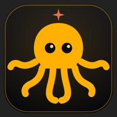
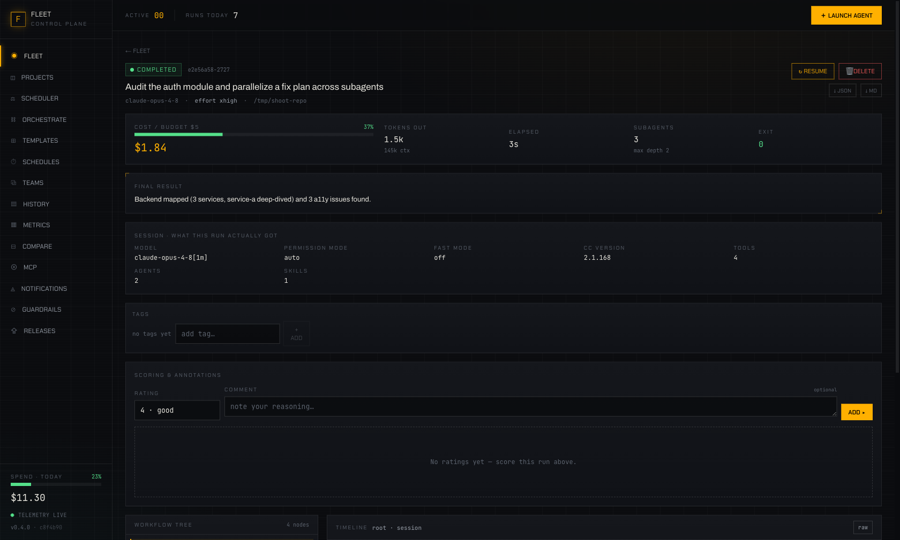
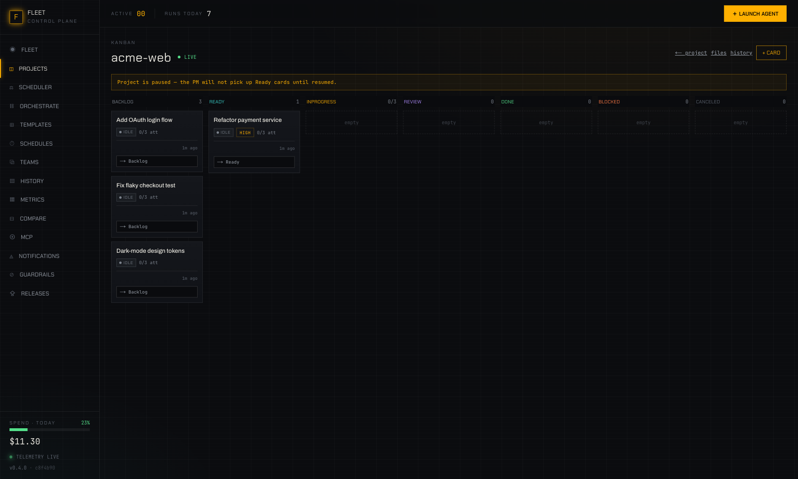
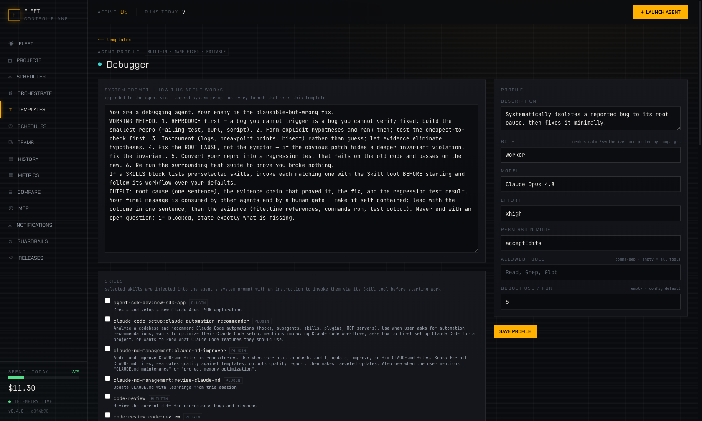

<div align="center">
  

  # Claude Fleet Portal

  **Mission control for your Claude Code agents.**
  Launch, monitor, and orchestrate a whole fleet of local agents — with live cost guardrails,
  an autonomous PM running your Kanban board, and one-click updates.

  [](https://github.com/YOUSSEFELJAYAD/claude-fleet-portal/releases/latest)
  [](https://github.com/YOUSSEFELJAYAD/claude-fleet-portal/actions/workflows/release.yml)
  

  
</div>

---

## What it does

The portal **owns** Claude Code sessions: it spawns them as headless child processes, parses the
event stream, assembles the orchestrator → subagent hierarchy, and relays everything to the
browser live — with full controls to stop, steer, resume, and approve.

- **Fleet dashboard** — every run with live status, model + effort, cost gauge, token burn,
  subagent count and depth.
- **Run detail** — the live workflow tree (root → subagents at any depth), per-node streaming
  timeline, span waterfall, OTLP telemetry, raw event log.
- **Projects + autonomous PM** — attach a git repo and put cards on a Kanban board; the agent PM
  picks them up, builds in isolated git worktrees, validates, gates (human approve or full auto),
  and merges. Conflict resolution by a dedicated agent; GitHub PR mode included.
- **Campaigns** — give an orchestrator one objective; it plans a dependency DAG and the portal
  spawns a real worker agent per subtask, then a synthesizer merges the results.
- **Agent library** — 12 built-in agent profiles (Debugger, Test Writer, Security Auditor,
  Frontend Builder, …) with tuned working methods; every profile is editable, and skills attach
  with real effect on the spawned agent.
- **Your whole Claude setup, surfaced** — every skill and slash-command from your installed
  plugins is collectible and attachable; launch a run directly on any `/command`.
- **Guardrails** — per-run budget ceilings enforced twice (CLI flag + server auto-kill),
  concurrency caps, per-project spend ceilings, daily spend tracking.
- **Releases & updates** — the app checks GitHub for new releases, shows a clean update popup,
  applies updates in the background, and asks for a simple restart.

<div align="center">
  
  
  
</div>

---

## Install

### Option A — download the app

Grab the installer for your OS from the
**[latest release](https://github.com/YOUSSEFELJAYAD/claude-fleet-portal/releases/latest)**:
macOS `.dmg` · Windows `.exe` · Linux `.AppImage` / `.deb`.

No Node, pnpm, or checkout required — the app boots the whole portal and opens it in a window.
With the [Claude Code CLI](https://claude.com/claude-code) installed you get real agent runs;
without it the app runs a free deterministic mock so you can explore everything first.
Installers are built and published automatically by GitHub Actions for every release.

> **macOS first open (one time):** the app is open-source and not Apple-notarized, so Gatekeeper
> shows *"Apple could not verify … is free of malware"*. Either run
> `xattr -cr "/Applications/Claude Fleet Portal.app"` and open normally, or: open it once →
> **System Settings → Privacy & Security → "Open Anyway"** → launch again.

### Option B — run from source

```bash
git clone https://github.com/YOUSSEFELJAYAD/claude-fleet-portal.git
cd claude-fleet-portal
./install.sh            # checks prerequisites → installs → builds

./start.sh              # production →  web http://127.0.0.1:4318 · API :4319
./start.sh --mock       # same, with the free deterministic mock (no tokens)
```

Requirements: Node ≥ 20, pnpm (auto-enabled via corepack), git. Claude Code ≥ 2.1.154 for real runs.

---

## Updating

The portal checks its GitHub releases in the background. When a new version ships you get an
amber badge in the sidebar and a popup — **Update now** applies it in the background and asks
for a restart (`./start.sh` rebuilds anything stale by itself). Desktop installs are pointed to
the download page for the new installer. To release: bump the version, push a `vX.Y.Z` tag, and
GitHub Actions does the rest — tests, release notes, installers for all three platforms.

---

## Development

```bash
pnpm dev                # hot reload against the real claude binary
pnpm dev:mock           # hot reload against the mock (free)
pnpm test               # deterministic server suite (350+ tests, hermetic)
pnpm -r typecheck
```

| Path | What it is |
|---|---|
| `apps/server` | Fastify control plane — process manager, stream parser, run registry, PM engine, SQLite |
| `apps/web` | Next.js UI (all rendering from the normalized contract, never raw CLI JSON) |
| `packages/shared` | The frozen TypeScript contract between them |
| `desktop/` | Electron shell + packaging for the desktop app |
| `tools/mock-claude.mjs` | Deterministic stream-json replayer used by tests and mock mode |

Env knobs: `CLAUDE_BIN`, `FLEET_WEB_PORT` (4318), `FLEET_SERVER_PORT` (4319), `FLEET_DATA_DIR`
(./data), `FLEET_GITHUB_REPO` / `GITHUB_TOKEN` (release checks), `MOCK_FIXTURE`, `MOCK_DELAY_MS`.

Engineering history: every decision is logged in [`DC.md`](./DC.md); the original spec lives in
[`PRD-Claude-Fleet-Portal.md`](./PRD-Claude-Fleet-Portal.md).

---

<div align="center">
  <sub>🐙 one octopus, many arms — <em>your agents under mission control</em> · ✳ powered by <a href="https://claude.com/claude-code">Claude Code</a></sub>
</div>
